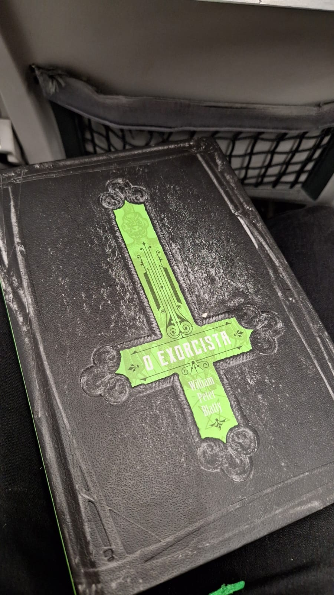
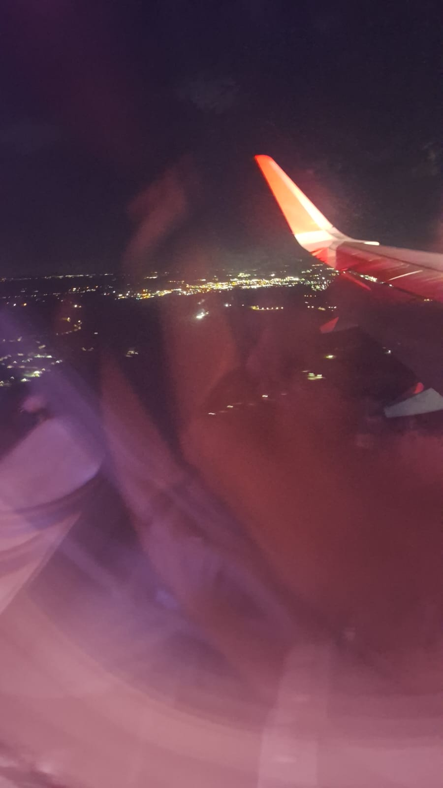
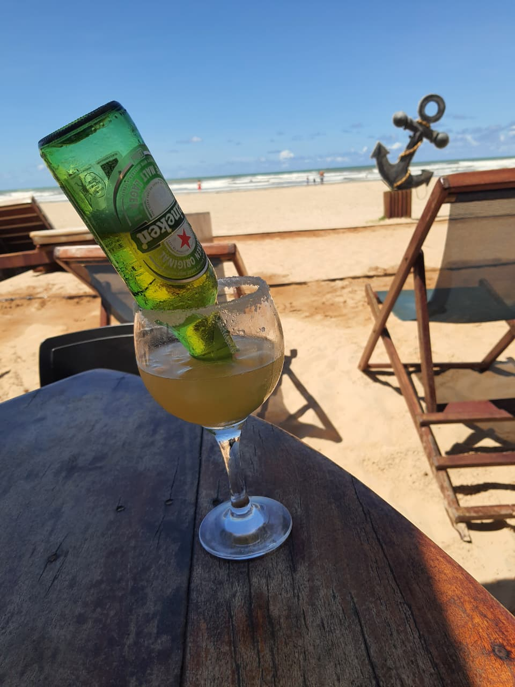
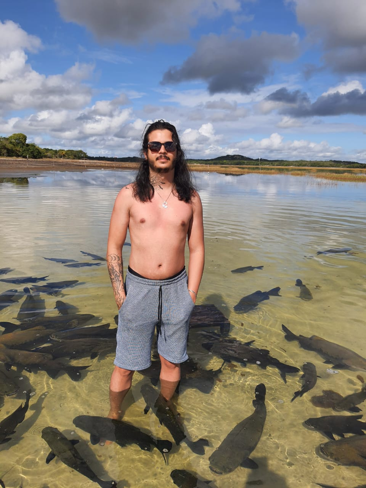
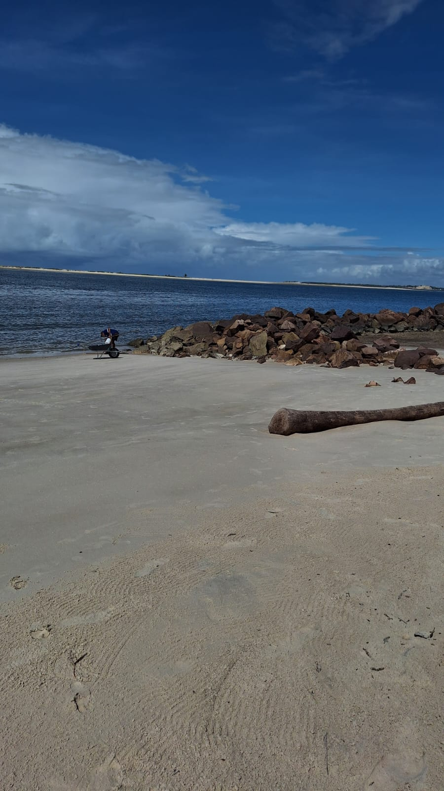
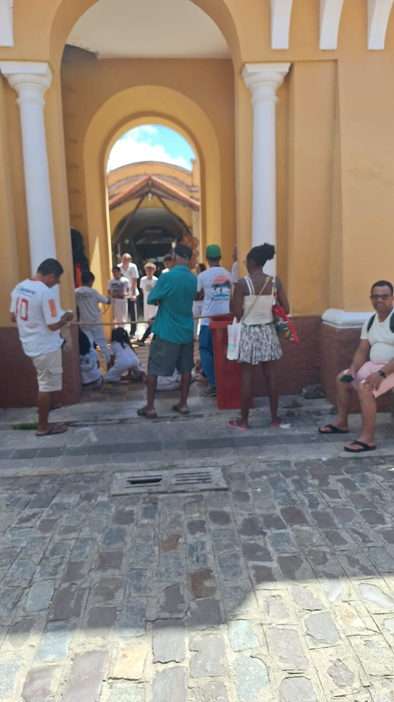
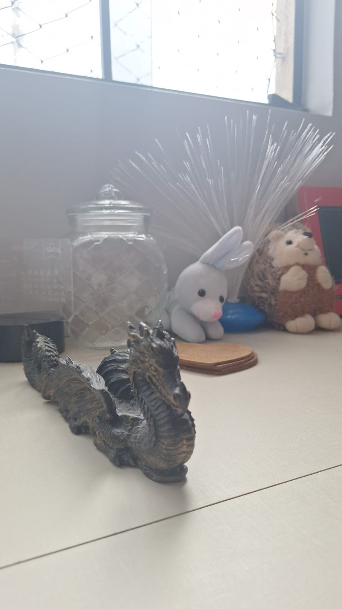
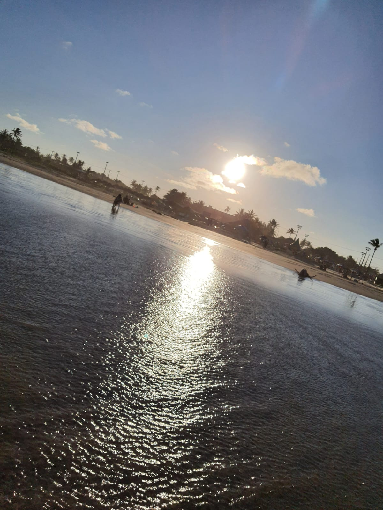
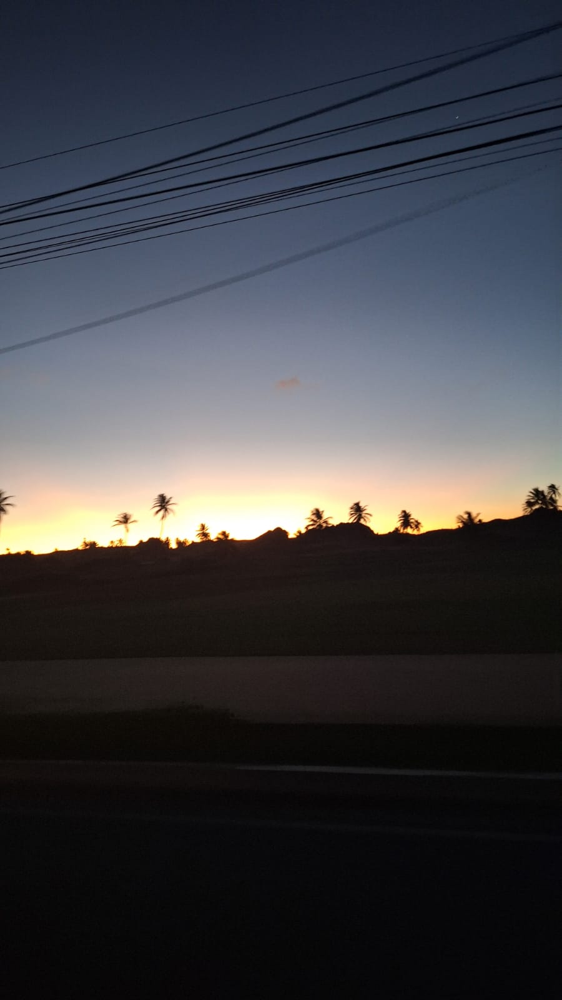

# Minha ida até Aracaju

Um pouquinho da minha experiência indo para Aracaju pela segunda vez.

Na primeira vez eu fiquei apenas o fim de semana e foi tudo muito corrido mas, ainda assim, foi uma ótima viagem. Fui com a companhia da minha mãe e, dessa segunda vez, fui com ela novamente e fiquei 4 dias.

## Dia 0

> A correria para não esquecer esquecer nada

Por mais que separe as coisas um tempinho antes, sempre fico com aquela sensação de que estou esquecendo algo.

Além de que eu trabalhei até o último minuto (mesmo eu tendo ganhado folga). A sorte é que o vôo era 20:00 então deu tempo de fazer tudo.

        

Pro vôo eu levei meu livro do Exorcista, que já tem um tempão que eu quero terminar mas não crio vergonha na cara para terminar de ler, e isso me faz lembrar que eu preciso comprar um fone de ouvido também.

Celular sem entrada pra fone de ouvido é uma coisa super interessante - pra não dizer outra coisa.

        

Sobre o vôo... Bom, ainda bem que não era o vôo 180.

## Dia 1

> Finalmente a praia

Pra quem não tirava folgas extendidas a 2 ou 3 anos, a praia provavelmente seria o melhor lugar que eu poderia escolher. O som do mar, a vista, o clima... A receita perfeita pra uma boa cerveja e ficar pensando no nada.

        

Fiquei na praia de Aruana, nela têm lugares com estruturas melhores: banheiros, boas cadeiras, música, etc.. O lugar que eu fiquei se chamava "Âncora".

É um bom lugar, todas as mesas tem sombra durante o dia inteiro.

Mas salgado não era só a água do mar, o preço também era bem salgado. O cozumel da imagem custou R$ 30,00... Mas tudo bem, era o primeiro dia e tinha um shot de tequila nele.

## Dia 2

> Lagoa dos Tambaquis e Praia do... Saco?

Dia de passeio... Dia de acordar 6 da manhã para poder estar pronto às 7 e é isso.

O passeio teve duas paradas:

### [Lagoa dos Tambaquis](https://www.sergipeturismo.com/lagoa-dos-tambaquis/)

É uma lagoa onde tem um amontoado de peixes que ficam esperando comida. Eles são bem dóceis e os recém chegados passavam entre as pernas parecendo gatos quando pedem comida.

        

O lugar é bem calmo, e você poderia comprar uma ração para poder alimentar os peixes.

A entrada era R$ 20,00 por pessoa e a ração R$ 5,00.

### [Praia do Saco](https://www.sergipeturismo.com/praia-do-saco/)

É uma praia bem bonita (eleita como uma das mais bonitas segundo a revista francesa [Grand Voyageur](http://bloggrandvoyageur.fr/). Ela é uma praia sem ondas devido as outras ilhas que cercam a praia.

        

Sendo assim, ele é bastante influenciada pela maré e se torna praticamente uma lagoa pra quem gosta de entrar na água.

No fim do dia, por exemplo, o lugar onde está aquele tronco na foto anterior já estava praticamente submerso.

O lugar também oferece passeio de buggy, lancha e quadriciclo.

E o pastel de camarão... Que pastel bom!

## Dia 3

> [O mercado central](https://www.sergipeturismo.com/mercado-municipal-de-aracaju/)

Uma viagem não é uma viagem sem compras. Minha mãe que o diga, tivemos que voltar ao hotel antes de ir para a praia por conta das sacolas.

O mercado tem bastante variedade de artesanato e bordados, bastante lugar para comprar aperitivos da região também. E possui um bom espaço para eventos culturais.

        

Eu comprei um incenseiro muito lindo, afinal.

        

## Dia 4

> A despedida

Dia de preguiça e... Mais praia!

Inclusive, esse dia eu fui para um outro quiosque na praia de Aruana. Ele se chama "Mar da Espanha", muito bom o ambiente e o rapaz que me atendeu era bem gente boa também.

Os preços eram bem mais acessíveis, enquanto que no Âncora uma cerveja era R$ 20,00 no Mar da Espanha era R$ 14,00. Teve um grupo de axé ao vivo também que estava bem afinado e animado.

        

Por fim, foi o melhor dia de praia.

E chegou o momento de me despedir e fazer a última volta para o hotel.

        

Valeu muito a pena a viagem e voltaria para Aracaju com certeza! Uma cidade muito limpa, um clima agradável, praias muito boas e comida boa também!
